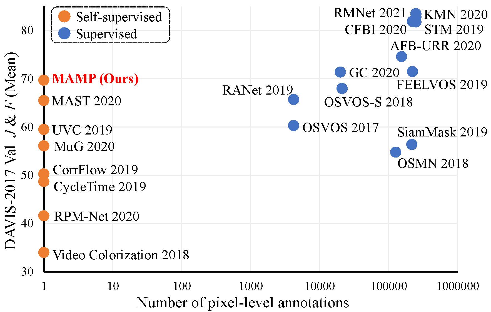
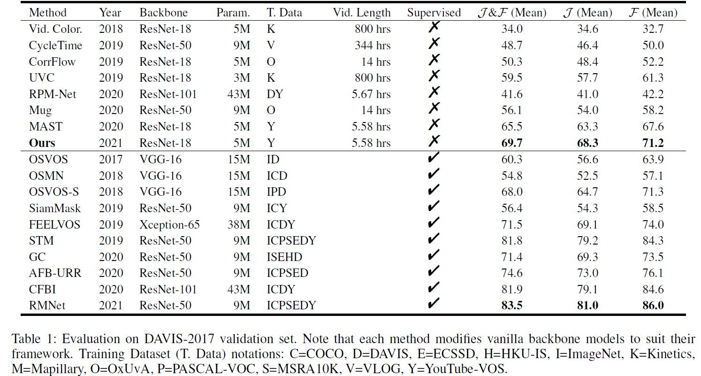
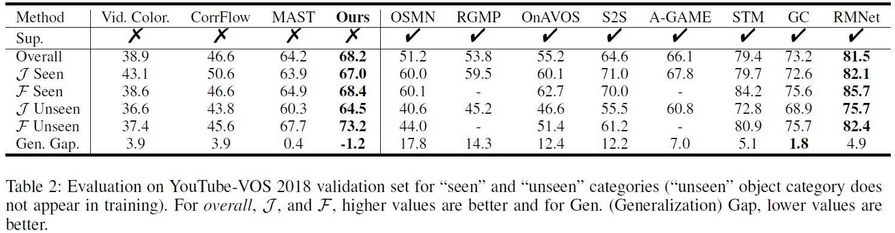

[](https://arxiv.org/abs/2107.12569)


# Self-Supervised Video Object Segmentation by Motion-Aware Mask Propagation (MAMP)

This repository contains the source code (PyTorch) for our paper:

[Self-Supervised Video Object Segmentation by Motion-Aware Mask Propagation](https://arxiv.org/abs/2107.12569)


## Citation
```
@misc{Miao2021MAMP,
  author        =  {Bo Miao and Mohammed Bennamoun and Yongsheng Gao and Ajmal Mian},
  title         =  {Self-Supervised Video Object Segmentation by Motion-Aware Mask Propagation},
  howpublished  =  {arXiv},
  year          =  {2021}
}
```


## Requirements
The code has been trained and tested with PyTorch 1.9 (1.9.0a0+gitc91c4a0), Python 3.9, and Cuda 11.2.

Other dependencies could be installed by running:
```Shell
pip install -r requirements.txt
```

## Required Data
To evaluate/train MAMP, you will need to download the required datasets. 
* [DAVIS-2017 (480p)](https://davischallenge.org/davis2017/code.html)
* [YouTube-VOS](https://youtube-vos.org/dataset/vos/)

You can create symbolic links to wherever the datasets were downloaded in the `datasets` folder
```Shell
├── datasets
    ├── DEMO
        ├── valid_demo
            ├── Annotations
            ├── JPEGImages       
    ├── DAVIS
        ├── JPEGImages
        ├── Annotations
        ├── ImageSets
    ├── YOUTUBE
        ├── train
        ├── valid
        ├── all (the data is from train_all_frames)
            ├── videos
                ├── consecutive frames
```

## Demo
- Use the following command in `scripts` folder to run a basic demo to visualize the segmentation results of MAMP.
    ```
    sh test_demo.sh
    ```
  
## Train
- Use the following command in `scripts` folder to train.
    ```
    sh train.sh
    ```

## Test and evaluation
- The pre-trained model can be downloaded at [Google drive](https://drive.google.com/drive/folders/1beeyiom8b0M6xUhu9-YHLinmI8jMcv46?usp=sharing). 
- Use the following commands in `scripts` folder to evaluate on DAVIS and YouTube-VOS, separately.
  An approximate performance on DAVIS can be directly obtained from the output logs, or you can evaluate MAMP on DAVIS with the [official evaluation code](https://github.com/davisvideochallenge/davis2017-evaluation). 
  The performance on YouTube-VOS need to be evaluated on the [official server](https://competitions.codalab.org/competitions/19544). 
    ```
    sh test_davis.sh
    ```
    ```
    sh test_ytb.sh
    ```

## (Optional)
- You can optionally use ```--is_amp``` to enable Automatic Mixed Precision in the evaluation of DAVIS and YouTube-VOS
- ```torch.cuda.empty_cache()``` could help reduce fragmentation of GPU memory in the evaluation process.

## Results
Comparison with other methods on DAVIS-2017  |
:-------------------------:|
 |

Results on DAVIS-2017  |  Results on YouTube-VOS
:-------------------------:|:-------------------------:
  |  

## Licenses
This repo contains third party code.
It is your responsibility to ensure you comply with license
here and conditions of any dependent licenses.

<!--te-->


